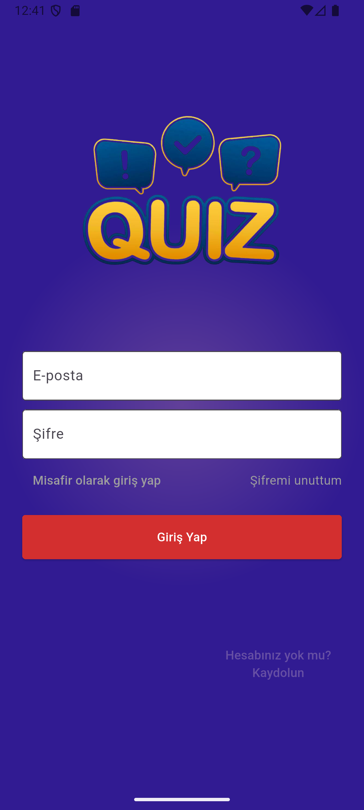
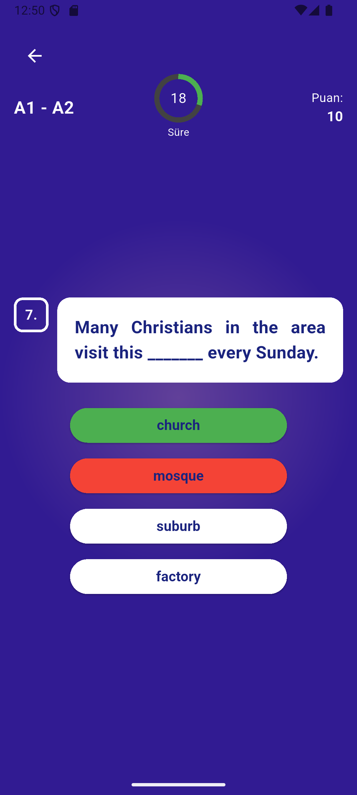
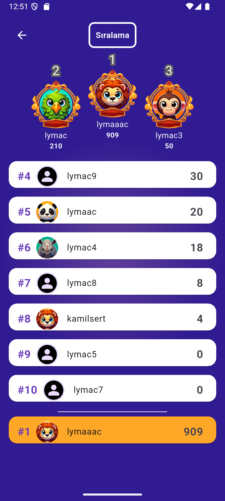
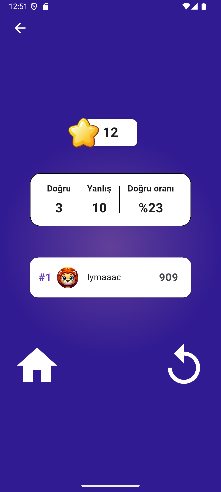

# 📚 Eng Quiz App - English Quiz Application (Flutter + Firebase)

This is a mobile English quiz application built with Flutter and integrated with Firebase services.  
Users can register, log in, choose difficulty, answer questions from a live database, and compete on a global leaderboard.

## 🚀 Features

- 📱 Modern and responsive Flutter UI  
- 🔐 Firebase Authentication: register, login, password reset  
- 📊 Firebase Realtime Database for:  
  - Managing questions  
  - Tracking user scores  
  - Global leaderboard  
- 🎮 Difficulty levels: Easy, Medium, Hard  
- 🧠 Quiz system: real-time answer validation and score calculation  
- 🧍 User profile:  
  - Change display name  
  - Choose avatar  
  - Delete account  
- 📝 Authenticated users can add new questions to the database

## 📸 Screenshots

<table>
  <tr>
    <td align="center">
      <strong>🔐 User Login</strong><br/>
      
    </td>
    <td align="center">
      <strong>🧠 Quiz Screen</strong><br/>
      
    </td>
  </tr>
  <tr>
    <td align="center">
      <strong>🏆 Leaderboard</strong><br/>
      
    </td>
    <td align="center">
      <strong>📊 Result Page</strong><br/>
      
    </td>
  </tr>
</table>


## 🔧 Getting Started

```bash
git clone https://github.com/lymac0/eng_quiz_app.git  
cd eng_quiz_app  
flutter pub get
```

### 🔥 Firebase Setup

1. Create a Firebase project in the [Firebase Console](https://console.firebase.google.com/)  
2. Enable Authentication (Email/Password) and Realtime Database  
3. Download `google-services.json` and place it in `android/app/`  
4. (Optional) Run `flutterfire configure` to generate `firebase_options.dart`  
5. Apply secure database rules like below:

```json
{
  "rules": {
    "users": {
      ".read": true,
      ".write": "auth != null",
      ".indexOn": ["score"]
    },
    "userstats": {
      ".read": true,
      ".write": "auth != null"
    },
    "questions": {
      ".read": true,
      ".write": "auth != null"
    }
  }
}
```

## 🧪 Run the App

```bash
flutter run
```

> ⚠️ This application currently supports **Android platform only**.

## 📁 Project Structure

```
lib/  
├── auth/               → Login, register, password reset  
├── models/             → User data model  
├── screens/            → Main pages (quiz, leaderboard, home)  
├── settings/           → Profile settings, question management  
├── widgets/            → Reusable UI components  
└── main.dart           → App entry point  
```

